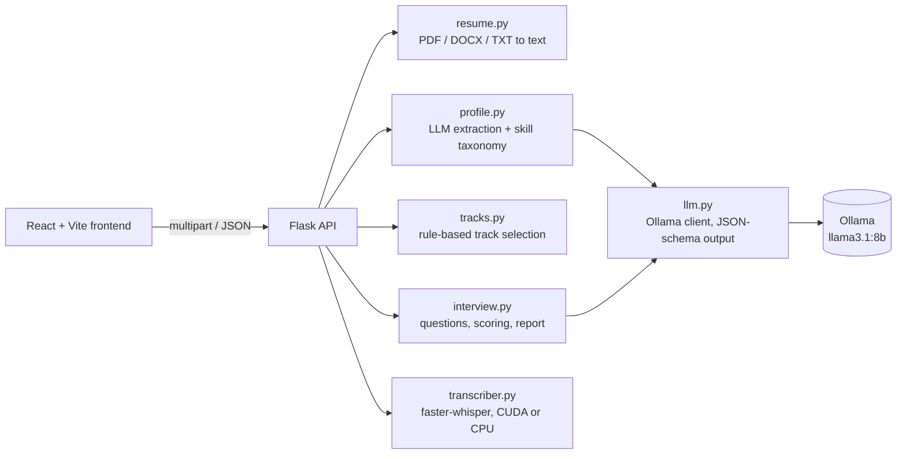

# MockerAI

Mock interviews generated from your resume, answered out loud, and scored by a local LLM.

Upload a resume and MockerAI extracts your skills, roles and projects, suggests interview tracks that match them, and asks questions that reference your own work ("You cut p95 latency by 58% with Redis caching. How did you decide what to cache?"). Answer by voice or by typing; every answer gets a rubric score, specific feedback and the key points you missed, and the session ends with a report and a practice plan.

Everything runs on your machine: Whisper for speech-to-text, Llama 3.1 8B through Ollama for extraction, question generation and scoring. No resume or recording leaves the computer.

**Try it:** the UI is hosted at [yutrix12.github.io/AI-Mock-interviewer](https://yutrix12.github.io/AI-Mock-interviewer/). It connects to a backend on your own computer, so start the backend first (steps 1 and 2 under [Running it](#running-it)); you can skip the frontend step. If the browser asks to let the site access devices on your local network, allow it.

## Features

- **Resume parsing**: PDF, DOCX and TXT. LLM extraction into a typed schema, backed by a skill taxonomy that normalises names ("reactjs", "Postgres", "AWS (EC2, S3)") and still finds skills by keyword if the model is unavailable.
- **Interview tracks from your skills**: a full interview loop, skill tracks (frontend, backend, ML, data, cloud, mobile, databases), a resume deep dive and a behavioral round. Track selection is rule-based, so the same resume always gives the same options. Skills can be edited before starting.
- **Tailored questions**: generated per track, difficulty (entry, mid, senior) and length, mixing technical, project and behavioral questions. Falls back to resume-aware templates if generation fails.
- **Voice or typed answers**: live microphone level, a 2-minute timer, GPU transcription with hallucination filtering.
- **Rubric scoring**: content, clarity, structure and relevance, combined in code with per-question-type weights and consistency guards.
- **Session report**: overall and per-dimension scores, strengths, focus areas, a one-week practice plan, and a question-by-question breakdown. Printable.

## Architecture



The API is stateless: the client sends the profile, track and question with each call, so there is no server session to expire and every endpoint is easy to test.

| Endpoint | Purpose |
|---|---|
| `POST /api/resume` | Upload a resume, get back a profile and interview tracks |
| `POST /api/tracks` | Recompute tracks after the user edits their skills |
| `POST /api/questions` | Generate questions for a track, difficulty and length |
| `POST /api/answer` | Transcribe (if audio) and score one answer |
| `POST /api/report` | Summarise a finished interview |
| `GET /api/health` | Model and transcriber status |

### Reliable output from a small local model

An 8B model is fast enough to run locally but inconsistent, so the backend does not trust its output blindly:

- **Constrained generation.** Every call sends a Pydantic model's JSON schema as Ollama's `format`, then validates the reply and retries once if it is malformed.
- **Scores are computed in code.** The model rates four dimensions from 0 to 10; the overall score is a weighted average whose weights depend on the question type (content matters most for technical questions, structure more for behavioral ones).
- **Consistency guards.** Answers under 40 words can't score above 5 on structure, and the overall score can't exceed content + 2, so a short, polished answer with little substance can't rate as "strong". These rules came out of testing real model output.
- **Hallucination filtering.** Whisper invents phrases like "Thanks for watching!" for silence or noise. Segments Whisper itself flags as likely non-speech are dropped, and transcripts that are only a known stock phrase count as empty.
- **Graceful degradation.** If Ollama is down, resume parsing falls back to keyword matching, question generation to resume-aware templates, and the report to a summary built from the scores.
- **Prompt-injection hygiene.** Resume text and answers are wrapped in tags and treated as data, never as instructions.

## Running it

Requirements: Python 3.11+, Node 18+, [Ollama](https://ollama.com), and optionally an NVIDIA GPU for faster transcription.

```bash
# 1. Model
ollama pull llama3.1:8b

# 2. Backend (from the project root)
python -m venv .venv
.venv/Scripts/activate          # Windows; use `source .venv/bin/activate` on macOS/Linux
pip install -r backend/requirements.txt
python -m backend               # http://127.0.0.1:5000

# 3. Frontend
cd frontend
npm install
npm run dev                     # http://localhost:5173
```

On Windows, set `PYTHONUTF8=1` if the console can't print Unicode log messages.

The backend accepts requests from the local dev server and from the hosted UI on GitHub Pages. To serve the UI from somewhere else, add its origin to `CORS_ORIGINS` (comma-separated). Pushes to `main` that touch `frontend/` redeploy the hosted UI through GitHub Actions.

Configuration uses environment variables: `OLLAMA_MODEL` (default `llama3.1:8b`), `OLLAMA_URL`, `WHISPER_MODEL` (default `small.en`), `WHISPER_DEVICE` (`auto`, `cuda` or `cpu`), `LLM_CONTEXT`, `MAX_UPLOAD_MB`, and `VITE_API_URL` for the frontend.

No resume at hand? The upload screen has a "Try a sample" button.

## Tests

```bash
pytest                                          # 54 backend tests, no model needed
python backend/scripts/smoke_test.py            # end-to-end run against the real models
cd frontend && npm run lint && npm run build
```

The unit and API tests use a fake LLM and a fake transcriber injected through the app factory, so they cover parsing, the skill taxonomy, track rules, scoring maths, fallbacks and every endpoint's error handling in well under a second.

## Project structure

```
backend/
  app.py            Flask app factory and routes
  config.py         Settings from environment variables
  schemas.py        Pydantic models (API shapes + LLM output schemas)
  llm.py            Ollama client with schema-constrained output
  resume.py         PDF / DOCX / TXT text extraction
  skills.py         Skill taxonomy, aliases, keyword scan
  profile.py        Resume text to candidate profile
  tracks.py         Rule-based interview tracks
  interview.py      Question generation, scoring, report
  prompts.py        Prompt templates
  transcriber.py    faster-whisper wrapper
  tests/            pytest suite
  scripts/          End-to-end smoke test
frontend/src/
  App.jsx           View flow: home, upload, setup, interview, report
  hooks/            useInterview (session state machine), useRecorder (mic + level meter)
  components/       Screens and UI pieces
  lib/              API client, config, formatting, speech synthesis
```
